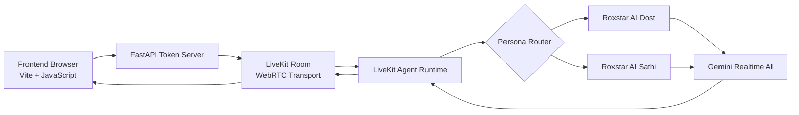

# 🎙️ Roxstar AI Voice Room

A real-time AI voice room application built with LiveKit, Gemini Realtime AI, Python, FastAPI, and Vite. It enables natural, multilingual conversations in Hindi, Hinglish, and English with two AI personas:

- 👨 Roxstar AI Dost — friendly, casual male assistant
- 👩 Roxstar AI Sathi — warm, cheerful female assistant

This project combines a real-time WebRTC voice room, a Python backend for token generation and orchestration, and a browser-based frontend for user interaction.

---

## Overview

Roxstar AI Voice Room is designed for multi-user conversational AI experiences in a shared voice environment. Participants can join a LiveKit room, speak naturally, and interact with AI assistants that can respond in real time, retain conversational context, and switch personas when needed.

### Features

- Real-time voice conversations using LiveKit
- Multi-language support: Hindi, Hinglish, English
- Two distinct AI personas with handoff capability
- Conversational context retention
- Multi-user room participation
- Logging and runtime diagnostics
- Secure environment-based configuration

---

## Architecture



### Architecture Flow

1. The frontend client connects to a LiveKit room from the browser.
2. The FastAPI backend issues tokens and coordinates the app environment.
3. LiveKit handles WebRTC transport and room state management.
4. The LiveKit agent runtime loads the appropriate assistant persona.
5. Gemini Realtime AI converts speech to conversational responses.
6. The AI voice output is streamed back to the room for all participants.

---

## Technology Stack

| Component | Technology |
| --- | --- |
| Frontend | Vite + JavaScript + HTML/CSS |
| Backend | Python + FastAPI |
| Real-time communication | LiveKit |
| AI agent framework | LiveKit Agents |
| AI model | Gemini Realtime AI |
| Configuration | python-dotenv |
| Certificates | certifi |
| Testing / diagnostics | Python + pytest |

---

## Project Structure

```text
roxstar-ai-voice-room/
├── backend/
│   ├── main.py                 # FastAPI backend and token generation
│   ├── agent.py                # Main LiveKit agent (Dost)
│   ├── agent_sathi.py          # Secondary persona agent (Sathi)
│   ├── diagnose_dispatch.py    # Dispatch and troubleshooting diagnostics
│   └── venv/                  # Local virtual environment
│
├── frontend/
│   ├── index.html              # App shell
│   ├── app.js                  # Frontend room logic
│   ├── style.css               # Frontend styling
│   └── ...
│
├── docs/
│   └── ...
├── .env                        # Local environment variables (do not commit)
├── .gitignore
├── README.md
├── requirements.txt
└── package.json                # Frontend package metadata
```

---

## Prerequisites

Before running the project, ensure you have:

- Python 3.x
- Node.js and npm
- A LiveKit account or self-hosted LiveKit server
- Google Gemini API access
- A configured `.env` file with required keys

---

## Installation

### Backend Setup

```bash
cd backend
python -m venv venv

# Linux / macOS
source venv/bin/activate

# Windows
# .\venv\Scripts\activate

pip install -r requirements.txt
```

### Frontend Setup

```bash
cd frontend
npm install
```

---

## Environment Configuration

Create a `.env` file at the project root:

```bash
LIVEKIT_URL=your_livekit_url
LIVEKIT_API_KEY=your_livekit_api_key
LIVEKIT_API_SECRET=your_livekit_api_secret
GOOGLE_API_KEY=your_google_api_key
```

Important:

- Do not commit `.env` to GitHub
- Keep API credentials private
- Use environment-specific configuration for local and production environments

---

## Running the Application

### Start the FastAPI Backend

```bash
cd backend
python main.py
```

The app is usually available at:

```text
http://127.0.0.1:8000
```

### Start the LiveKit Agent

```bash
cd backend
python agent.py dev
```

### Start the Frontend

```bash
cd frontend
npm run dev
```

Open the local Vite URL shown in the terminal in your browser.

---

## Personas

### Roxstar AI Dost
- Friendly, casual, engaging personality
- Best for relaxed and conversational interactions
- Naturally fits Hindi and Hinglish usage

### Roxstar AI Sathi
- Warm, supportive, cheerful personality
- More empathetic and encouraging in tone
- Ideal for user-friendly AI engagement

---

## Example Conversations

### Hindi / Hinglish

```text
User: Yaar aaj kaafi tired feel ho raha hai.
Dost: Haan, lagta hai aaj kaafi hectic day tha. Thoda break lena bhi important hai.
```

### English

```text
User: What is machine learning?
Dost: Machine learning is a way of teaching computers to learn patterns from data.
```

---

## Security

- Store secrets in `.env`
- Keep environment files out of version control with `.gitignore`
- Avoid logging sensitive API credentials
- Restrict access to production deployments with proper authentication and permissions

---

## Logging and Diagnostics

The application logs important runtime events, including:

- room join activity
- persona dispatch events
- handoff transitions between assistants
- troubleshooting diagnostics for live agent behavior

The `backend/diagnose_dispatch.py` utility helps trace agent dispatch and runtime behavior during development.

---

## Notes

This repository is intended for real-time experimentation and local development. For production deployment, consider adding:

- secure secret management
- monitoring and observability
- automated tests
- rate limiting and request validation
- more robust deployment configuration

---

## License

This project does not currently include a license file. If you plan to distribute or use it broadly, add an appropriate open-source license.
